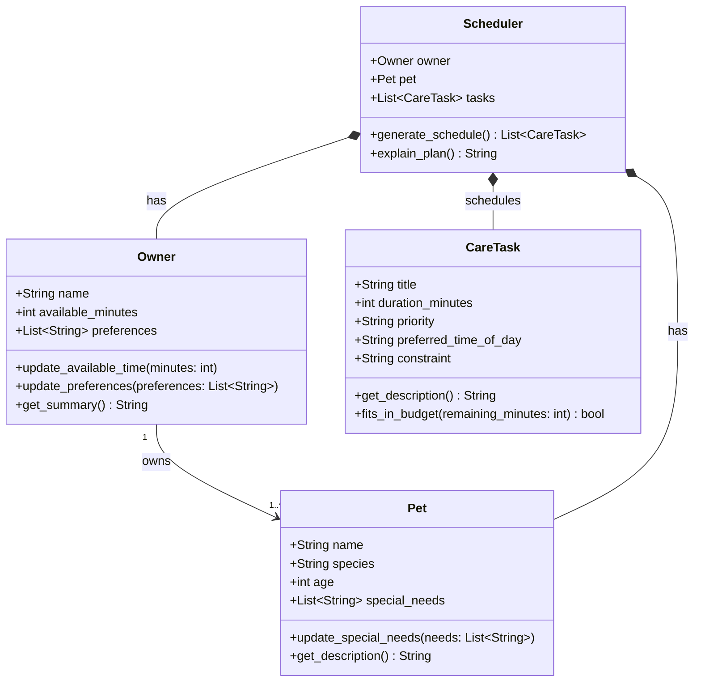

# PawPal+ Project Reflection

## 1. System Design

**a. Core user actions**

The three core actions a user should be able to perform in PawPal+:

1. **Add a pet** — The user enters basic information about their pet (name, species, age, and any special needs). This establishes the pet profile that all care tasks and scheduling decisions are built around. Without a pet profile, the system has no context for what kind of care is needed or how to prioritize it.

2. **Add and manage care tasks** — The user creates tasks representing the things their pet needs each day (e.g., a morning walk, medication at noon, feeding twice a day, grooming on weekends). Each task captures at minimum a name, estimated duration, and priority level. The user can also edit or remove tasks as their pet's routine changes over time.

3. **Generate and view today's schedule** — The user triggers the scheduler to produce a daily plan based on their available time, task priorities, and any constraints (e.g., medication must come before feeding). The system displays the ordered plan and explains why tasks were arranged that way, so the owner understands the reasoning and can trust or adjust it.

**b. Main objects (brainstorm)**

The system requires four main objects. Here is each one with its attributes and methods in natural language:

---

**`Owner`** — represents the person responsible for the pet's care.

- *Attributes:* name, available time per day (in minutes), and any scheduling preferences (e.g., prefers morning tasks, avoids tasks after 8pm).
- *Methods:* update available time, update preferences, get a summary of who the owner is and how much time they have.

---

**`Pet`** — represents the animal being cared for.

- *Attributes:* name, species (dog, cat, other), age, and any special needs or health notes (e.g., "needs medication before food", "low energy due to age").
- *Methods:* update special needs, get a description of the pet (used when explaining the schedule), check whether a task type is relevant for this pet.

---

**`CareTask`** — represents a single unit of care that needs to happen.

- *Attributes:* title (e.g., "Morning walk"), duration in minutes, priority level (low / medium / high), optional preferred time of day (morning / afternoon / evening), and an optional constraint (e.g., "must happen before feeding").
- *Methods:* get a short description of the task, compare priority against another task, check whether the task fits within a remaining time budget.

---

**`Scheduler`** — the brain of the system; takes the owner, pet, and task list and produces a plan.

- *Attributes:* the owner object, the pet object, and the list of care tasks.
- *Methods:* generate a daily schedule (sort and filter tasks by priority and time constraints), check whether all high-priority tasks fit within available time, produce a human-readable explanation of why each task was included and in what order, and return the final ordered plan as a list.

---

**c. UML Class Diagram**

**b. Initial design**

- Briefly describe your initial UML design.
- What classes did you include, and what responsibilities did you assign to each?

**b. Design changes**

- Did your design change during implementation?
- If yes, describe at least one change and why you made it.

---

## 2. Scheduling Logic and Tradeoffs

**a. Constraints and priorities**

- What constraints does your scheduler consider (for example: time, priority, preferences)?
- How did you decide which constraints mattered most?

**b. Tradeoffs**

- Describe one tradeoff your scheduler makes.
- Why is that tradeoff reasonable for this scenario?

---

## 3. AI Collaboration

**a. How you used AI**

- How did you use AI tools during this project (for example: design brainstorming, debugging, refactoring)?
- What kinds of prompts or questions were most helpful?

**b. Judgment and verification**

- Describe one moment where you did not accept an AI suggestion as-is.
- How did you evaluate or verify what the AI suggested?

---

## 4. Testing and Verification

**a. What you tested**

- What behaviors did you test?
- Why were these tests important?

**b. Confidence**

- How confident are you that your scheduler works correctly?
- What edge cases would you test next if you had more time?

---

## 5. Reflection

**a. What went well**

- What part of this project are you most satisfied with?

**b. What you would improve**

- If you had another iteration, what would you improve or redesign?

**c. Key takeaway**

- What is one important thing you learned about designing systems or working with AI on this project?
